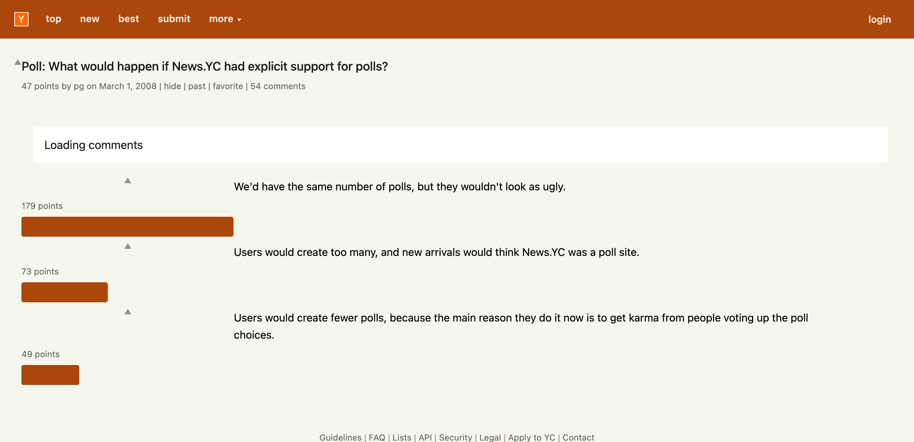
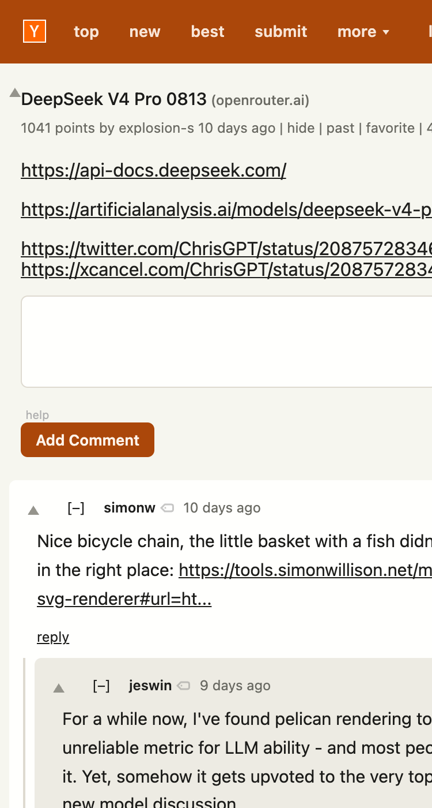
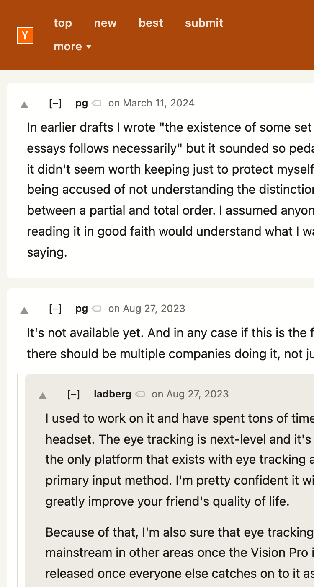
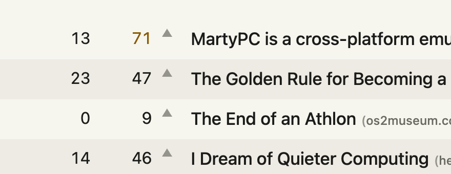
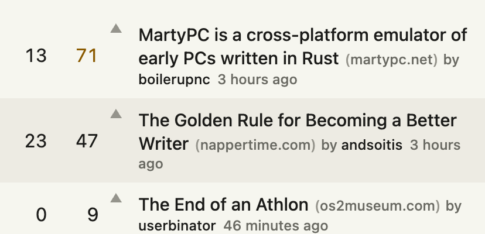
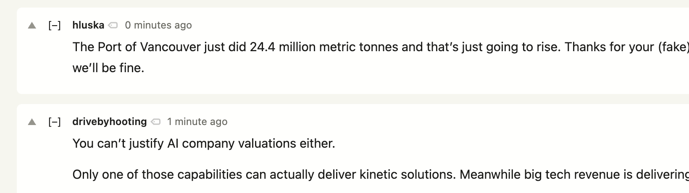
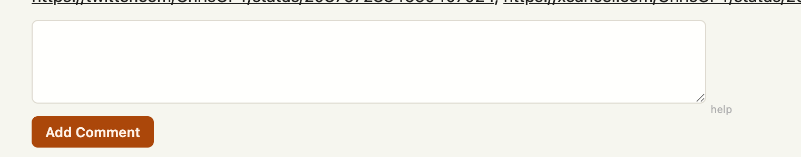
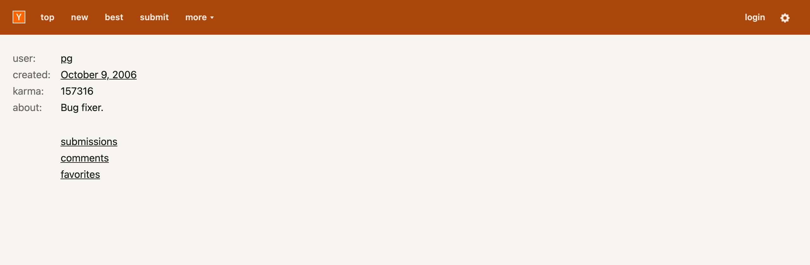

# Visual bugs — audit of 22 August 2026

Branch `aug_2026_rework`, `style.css` at the working-tree state of that date.

Nine bugs, ranked by impact and by how much they distract. Items 1 to 5 are
defects. Items 6 to 9 are polish.

## How this was measured

A Chromium profile loaded the unpacked extension. Playwright served cached
Hacker News bodies through route interception, so there is no network and no
rate limiting. The bodies were fetched once from the live site on 22 August
2026 and cover the front page, `/newest`, `/ask`, `/jobs`, a 453-comment item,
a poll, a user page, `/threads`, `/newcomments`, `/login` and `/submit`.

Each page was rendered at 1280, 1024, 820, 600, 414 and 375 CSS pixels. The
sweep also covered both themes, all five palettes and all three view modes.
Each render was measured for horizontal overflow, clipped text, overlapping
boxes and page errors, then screenshotted.

`y18.gif` is served as a 404 in the harness, because that is what Hacker News
returns for it now. Every other page asset is stubbed empty.

---

## 1. Poll pages break



A "Loading comments" box stays on screen forever. All 54 comments are missing.
The gear never appears, so the settings are unreachable. The poll options
scatter across three columns, and a heavy orange bar sits below each option,
away from the text it belongs to.

**Cause.** `js/hn.js:298` reads `.commtext` from a null element:

```
TypeError: Cannot read properties of null (reading 'querySelector')
    at HNComments.markupToNodeList (js/hn.js:298)
    at HNComments.apply (js/hn.js:567)
    at Object.doAfterCommentsLoad (js/hn.js:1640)
```

`HNComments.apply` (`js/hn.js:555`) accepts `table.itemlist` as a comment tree.
On a poll that table holds the poll options, which carry no comment rows. The
throw stops the rest of the rewrite, which is why the gear and the comments
never arrive.

**Fix.** Skip rows that hold no comment, or reject a poll options table before
the walk starts.

---

## 2. Comment pages scroll sideways on a phone



At a 375px viewport the item page is 475px wide. That is 100px of horizontal
scroll. The header, the subtext, the story links, the reply box and every
comment card are all cut off at the right edge. At 414px the excess is 61px.

There are two separate causes. Each one is enough on its own.

**Cause A — the story text does not wrap.** `.hnes-comment .text` gets
`overflow-wrap: anywhere` at `style.css:1332`, with a comment explaining why
`anywhere` and not `break-word`. `.toptext` — the story's own text on a self
post — never got the same rule. One bare URL in it holds HN's auto-layout table
open at 449px.

Verified: adding `.toptext { overflow-wrap: anywhere; }` alone takes the page
from 475px to 375px.

**Cause B — nesting depth.** 

`/threads` reaches 11 levels of nesting. `#hnes-comments .replies`
(`style.css:1838`) still charges `margin-left` plus `padding-left` plus a
border at every level on a narrow screen, about 13px each. Eleven levels cost
roughly 143px, which is more than a 375px viewport can give up. There is no cap
on total indent.

Verified: setting the per-level indent to zero takes `/threads` from 454px to
375px. Nothing else tested moved it.

**Fix.** Add the wrap rule to `.toptext`. Cap the cumulative indent, for example
by holding levels past a depth at a hairline.

---

## 3. The vote arrow does not line up with the score

This one repeats on every row of every index page, so it distracts the most for
its size.



On desktop the arrow's centre sits 5px above the centre of the score digits and
6px above the centre of the title. Measured on the front page at 1280px:

| box | top | bottom | centre |
| --- | --- | --- | --- |
| arrow | 86.9 | 96.9 | 91.9 |
| score text | 87.9 | 105.9 | 96.9 |
| title text | 87.9 | 107.9 | 97.9 |



On a phone it is worse. Rows wrap to three lines, the score centres itself in
the row, and the arrow stays pinned at the top. The gap grows to about 25px and
the two stop reading as one control.


On an item page the arrow touches the first letter of the title, with no gap at
all, and still sits above the cap height.

**Cause.** Hacker News sets `valign="top"` on `td.votelinks`. Nothing in
`style.css` overrides it. `#index-body #content table td.votelinks`
(`style.css:1065`) sets the width only.

---

## 4. `/threads` and `/newcomments` lose the story name



Every comment shows an author and a date only. Nothing says which story the
comment belongs to, so the page is a wall of context-free text.

**Cause.** `js/hn.js:285` reads the story link with:

```js
storyLinkEl = t.querySelector('.storyon a'),
```

Hacker News names that class `onstory`, not `storyon`. The lookup always
returns null, so `storyLinkText` stays empty, the `on-story` span keeps its
`nostory` class, and `style.css:1228` hides it. The fixture for `/threads`
contains 392 `onstory` elements and zero `storyon` elements.

**Fix.** Correct the selector to `.onstory a`.

---

## 5. Broken logo on `/login` and `/submit`


A broken-image icon sits in the top-left corner of the header.

**Cause.** These pages ship no header of their own, so HNES builds one at
`js/hn.js:1328`. That string hardcodes ``. Hacker News
returns 404 for `y18.gif` now and serves `y18.svg` instead.

The same stale name appears at `js/hn.js:804`:

```js
var icon = $('img[src="y18.gif"]');
```

That selector matches nothing on any page, so the title and the link it sets on
the logo never take effect anywhere.

**Fix.** Use `y18.svg` in both places.

---

## 6. The mobile header wraps badly


At about 414px the logo drops to the second line. "more" sits beside it, and
the gear separates from "login". The bar reads as disordered rather than as two
deliberate rows.

---

## 7. The reply box ignores the page width



The textarea keeps Hacker News' own fixed size on a wide screen, so it stops
well short of the content column. The "help" link hangs alone at the box's
bottom-right corner, outside it and below its baseline.

---

## 8. The user page is almost unstyled



`/user` shows a raw label-and-value table. It carries none of the card, spacing
or type treatment the rest of the extension applies.

---

## 9. The item subtext keeps Hacker News' raw pipes


The line reads `1041 points by explosion-s 10 days ago | hide | past |
favorite | 453 comments`. The index subline gets the new treatment; the item
page does not, so the two disagree.
